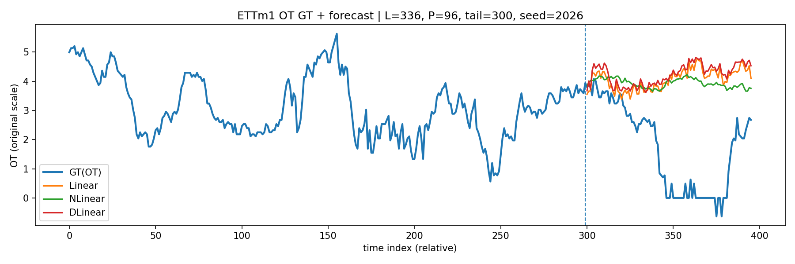

# 2026 winter KAIRI SAIL 임지유 [ TSF_DLinear 논문 구현 ]
Reproduction of **'Linear / NLinear / DLinear'** for Long-Term Time Series Forecasting

> ### ***Are Transformers Effective for Time Series Forecasting?***  
> *(Zeng et al., AAAI 2023)*

<br/>

### Overview
This repository reproduces **Linear, NLinear, and DLinear** models for
long-term time series forecasting on the **ETTm1** dataset.

The goal is to verify that simple linear models can achieve competitive
performance compared to transformer-based approaches, as reported in the paper.

<br/>

### Models
- **Linear**: Direct linear projection from past to future
- **NLinear**: Linear model with last-value normalization
- **DLinear**: Linear forecasting with trend/seasonal decomposition

All models are implemented in the **channel-wise independent setting**
(`individual=True`), following the paper.

<br/>

### Dataset
- **ETTm1** (15-minute resolution)
- Multivariate setting (C = 7)
- Download from: https://github.com/cure-lab/LTSF-Linear

Place the file at:
```
data/ETTm1.csv
```
<br/>

### Usage

Train a model (example: **DLinear**):
```bash
python -m scripts.train_ettm1 --model dlinear --individual --epochs 50 --seed 2026
```

Visualize a single test-window forecast:
```bash
python -m scripts.compare_and_plot
```
<br/>

### Notes
- Evaluation metrics: **MSE / MAE** on the test set
- Visualization is **qualitative** (single window)
- Raw data, checkpoints, and figures are excluded for reproducibility

<br/>

### Example Result

This figure shows a qualitative comparison of forecasting behavior across models for the last test window.



